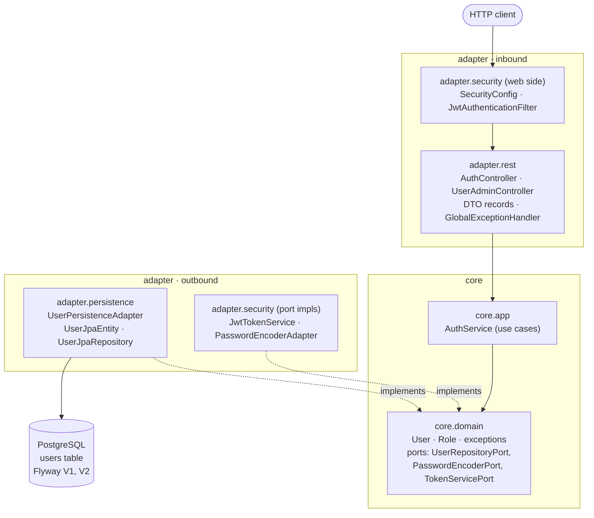

# thriveERP — Code Report & As-Built Architecture

> **Date:** 2026-10-05
> **Branch:** `cleanup/layout-and-packages`
> **Build status:** `./mvnw clean test` → **37 tests, 0 failures, 0 errors** (verified on the developer's machine, Java 21, Spring Boot 4.1.1).
> **Scope of this doc:** what is actually built today, how it is wired, what was fixed to get it green, and what is still missing. For the *planned* architecture see [ARCHITECTURE.md](architecture/ARCHITECTURE.md); for business rules see [DesignLogic.md](design/DesignLogic.md).

---

## 1. Summary

thriveERP is a Spring Boot 4 application structured as a hexagonal (ports & adapters) system. So far one vertical slice exists: **authentication and role management** (register, login with JWT, admin-only role change). The appointment, payment, audit and ERP-connector parts described in ARCHITECTURE.md are **not built yet**.

| Area | State |
|---|---|
| Auth slice (register / login / change role) | Built, tested |
| JWT stateless security | Built, tested |
| PostgreSQL + Flyway schema (`users` only) | Built |
| Appointments, payments, audit log | Not started |
| `EngineConnectorPort` + ERP mock / impl | Not started |
| Docker / docker-compose | Not started |
| Multi-module Maven split | Deferred (single module, packages mirror the layers) |

---

## 2. Tech stack (as built)

| Component | Version / choice |
|---|---|
| Java | 17 target (`java.version`), built and run on 21 |
| Spring Boot | 4.1.1 (Spring Framework 7, Spring Security 7, Hibernate 7.4, Jackson 3) |
| Build | Maven, `mvnw` wrapper |
| Database | PostgreSQL (runtime); H2 in PostgreSQL mode (tests only) |
| Migrations | Flyway (`spring-boot-starter-flyway` + `flyway-core` + `flyway-database-postgresql`) |
| Auth | Spring Security, stateless; JWT via jjwt 0.13.0 (HS256); BCrypt password hashing |
| Validation | Jakarta Bean Validation (`spring-boot-starter-validation`) |
| Tests | JUnit 5, Mockito, MockMvc, Spring Security Test |

---

## 3. Architecture as built

### 3.1 Layers and dependency direction



**The rule:** `core.domain` imports nothing from Spring, JPA or Jackson. `core.app` depends only on the domain ports. Adapters depend on the core, never the reverse. This is enforced by convention and code review, not by the compiler (single Maven module), so it is the first thing to erode if not watched.

### 3.2 Package layout

```
com.thriveerp
├── ThriveErpApplication
├── core
│   ├── domain/user      User, Role, UserRepositoryPort, PasswordEncoderPort,
│   │                    TokenServicePort, exception/{DuplicateUser,InvalidCredentials,UserNotFound}Exception
│   └── app/user         AuthService
└── adapter
    ├── persistence/user UserJpaEntity, UserJpaRepository, UserPersistenceAdapter
    ├── security         SecurityConfig, JwtAuthenticationFilter, JwtTokenService, PasswordEncoderAdapter
    └── rest
        ├── auth         AuthController + dto/{Register,Login}Request, AuthResponse, UserResponse
        ├── user         UserAdminController + dto/ChangeRoleRequest
        └── common       GlobalExceptionHandler
```

### 3.3 HTTP API

| Method & path | Access | Behaviour | Success | Errors |
|---|---|---|---|---|
| `POST /api/auth/register` | public | Creates a `CUSTOMER`. Body: username (3–50), email, password (8–100) | `201` + `UserResponse` | `400` validation, `409` duplicate username/email |
| `POST /api/auth/login` | public | Verifies credentials, returns JWT | `200` + `{token, tokenType:"Bearer"}` | `400` validation, `401` bad credentials |
| `PUT /api/users/{id}/role` | `ADMIN` only (`@PreAuthorize`) | Changes a user's role (`CUSTOMER`/`STAFF`/`ADMIN`) | `200` + `UserResponse` | `401` no/invalid token, `403` not admin, `404` unknown user |
| anything else | authenticated | — | — | `401` without a valid token |

### 3.4 Request flows

**Login**
1. `AuthController.login` validates the body, calls `AuthService.login`.
2. `AuthService` loads the user via `UserRepositoryPort`, checks the hash via `PasswordEncoderPort`. Same error message for unknown user and wrong password (no user enumeration through login).
3. `TokenServicePort.issueToken` → `JwtTokenService` signs a JWT: `sub=username`, claims `userId`, `role`, `iat`, `exp` (default 3600 s).

**Authenticated call**
1. `JwtAuthenticationFilter` reads `Authorization: Bearer <jwt>`, verifies signature and expiry, and sets a `UsernamePasswordAuthenticationToken` with authority `ROLE_<role>`.
2. `SecurityConfig` requires authentication for everything except register/login; `@EnableMethodSecurity` enforces `hasRole('ADMIN')` on the role endpoint.
3. Unauthenticated → `HttpStatusEntryPoint(401)`. Wrong role → Spring's access-denied handling → `403`.

### 3.5 Persistence

`users` table (Flyway `V1`), with timestamps converted to `TIMESTAMP WITH TIME ZONE` by `V2`:

| Column | Type | Notes |
|---|---|---|
| id | UUID | PK, assigned in the app (`UUID.randomUUID()`) |
| username | VARCHAR(50) | NOT NULL, UNIQUE |
| email | VARCHAR(255) | NOT NULL, UNIQUE, indexed |
| password_hash | VARCHAR(255) | BCrypt |
| role | VARCHAR(20) | default `CUSTOMER`; stored as the enum name |
| created_at / updated_at | TIMESTAMPTZ | mapped to `Instant` |
| version | INT | JPA `@Version` optimistic locking |

Notable design choice: because IDs are app-assigned, Spring Data's `save()` would treat every entity as new. `UserPersistenceAdapter.save` therefore loads the existing row first and updates it, which keeps `@Version` correct. Hibernate runs with `ddl-auto: validate` (Flyway owns the schema), `open-in-view: false`.

### 3.6 Configuration

| Property | Env var | Default | Notes |
|---|---|---|---|
| datasource url/user/password | `DB_HOST`, `DB_PORT`, `DB_NAME`, `DB_USER`, `DB_PASSWORD` | `localhost:5432/appointment_db`, `app_user`/`secure_pass` | dev defaults only |
| `app.jwt.secret` | `JWT_SECRET` | **none** | app refuses to start if blank or < 32 bytes |
| `app.jwt.expiration-seconds` | `JWT_EXPIRATION_SECONDS` | 3600 | |

Generate a secret with `openssl rand -base64 32`. See `.env.example`.

---

## 4. Tests (37)

| Class | Tests | Style |
|---|---|---|
| `UserTest` | 5 | pure unit |
| `AuthServiceTest` | 8 | unit, ports mocked |
| `UserPersistenceAdapterTest` | 2 | unit, Spring Data repo mocked |
| `JwtTokenServiceTest` | 7 | unit |
| `PasswordEncoderAdapterTest` | 4 | unit |
| `AuthControllerTest` | 6 | `@WebMvcTest` slice, security disabled |
| `UserAdminControllerTest` | 4 | `@WebMvcTest` slice with the real security chain |
| `ThriveErpApplicationTests` | 1 | full context on H2 (PostgreSQL mode) |

Only the last test needs a database, and it uses in-memory H2 so `mvn test` needs no Postgres or env vars.

---

## 5. What was fixed to reach a green build

The project was on Spring Boot 4.1.1, where several things Boot 3 provided implicitly are now separate modules. Three real defects:

| # | Symptom | Cause | Fix |
|---|---|---|---|
| 1 | `ThriveErpApplicationTests`: *Schema validation: missing table [users]* | Boot 4 moved Flyway auto-configuration out of the core autoconfigure jar. `flyway-core` alone no longer runs migrations at startup. | Added `spring-boot-starter-flyway` to `pom.xml`. |
| 2 | `UserAdminControllerTest` (4 tests): no `HttpSecurity` bean | The `@WebMvcTest` slice did not load Spring Security. | Added `spring-boot-starter-security-test` (test scope) and an explicit `@EnableWebSecurity` on `SecurityConfig`. |
| 3 | `changeRole_unauthorized_withoutAuthentication`: expected 401, got 403 | No authentication entry point configured, so anonymous requests got Spring's default 403. **A real API bug, not a test bug.** | `exceptionHandling(... HttpStatusEntryPoint(UNAUTHORIZED))` in `SecurityConfig`. |

Also added **`V2__timestamps_with_time_zone.sql`**: entity timestamps are `Instant`, which Hibernate 7 expects as `TIMESTAMP WITH TIME ZONE`, while `V1` declared plain `TIMESTAMP`. This was a precaution against a `validate` failure on Postgres. Done as a new migration so `V1`'s checksum stays valid.

Housekeeping: `.env.example` moved from `thriveERP-auth-module/` to the project root.

**Open verification item:** `V2` has been exercised on H2 only (via the full-context test). Run the app once against a real PostgreSQL to confirm both migrations apply cleanly there.

---

## 6. Known gaps and risks

Ordered roughly by importance.

1. **Duplicate registration race.** `AuthService.register` checks `existsByUsernameOrEmail` and then inserts. Two concurrent requests can both pass the check; the DB unique constraint then throws a `DataIntegrityViolationException`, which `GlobalExceptionHandler` does not map, so the client gets a `500` instead of `409`.
2. **No first admin.** Registration always creates `CUSTOMER`, and only an `ADMIN` can change roles. The first admin must be promoted by hand (`UPDATE users SET role='ADMIN' WHERE username='…'`) or via a one-off seed migration.
3. **Role is trusted from the token.** The JWT filter takes `role` from the claim and never re-reads the user. A demoted user keeps their old privileges until the token expires (default 1 h). There is also no token revocation, refresh or logout.
4. **Admin can demote themselves**, including the last admin. No guard in `changeRole`.
5. **Email/username case sensitivity.** `Alice` and `alice` are different users; email uniqueness is case-sensitive.
6. **No brute-force protection** on `/api/auth/login` (no rate limit or lockout).
7. **Secrets are plaintext env vars** and the Postgres dev password defaults to `secure_pass`. Fine for local dev; needs a secrets store before any real deployment.
8. **Single Maven module.** The hexagonal boundary is convention only. The planned multi-module split would make it compiler-enforced.
9. **Docs drift.** `CODE_STRUCTURE.md` still shows the old `com.thriveerp.thriveERP` package path and lacks the 2026-10-05 changes; `tech_version.md` still has `TBD` versions (this report has the real ones); `pom.xml` has empty `<name/>`, `<description/>`, `<licenses>`, `<developers>`, `<scm>` placeholders.
10. **Test/production database divergence.** The full-context test runs on H2; SQL features that behave differently on PostgreSQL will not be caught by `mvn test`.

---

## 7. Not built yet (from ARCHITECTURE.md)

| Planned | Status |
|---|---|
| `Appointment` / `Payment` domain + tables | not started |
| Reschedule counter, status machine | not started |
| `EngineConnectorPort`, `adapter-erp-mock` (`@Profile("erp-mock")`), `adapter-erp-impl` | not started |
| `adapter-audit` + `audit_log` via domain events | not started |
| `Dockerfile`, `docker-compose.yml` (Postgres + app) | not started |
| Multi-module split | deferred |

---

## 8. Suggested next steps

1. Run the app once against Postgres to verify migrations V1 + V2 (`export JWT_SECRET=$(openssl rand -base64 32); ./mvnw spring-boot:run`) and exercise register → login → role-change with `curl`.
2. Map `DataIntegrityViolationException` → `409` (gap 1) and add a test.
3. Decide the first-admin story (gap 2): seed migration vs. a one-time bootstrap property.
4. Add `Dockerfile` + `docker-compose.yml` (ARCHITECTURE.md §7) so the stack starts with one command.
5. Start the appointment slice using the same four-layer shape (`core/domain/appointment`, `core/app/appointment`, `adapter/persistence/appointment`, `adapter/rest/appointment`), then `EngineConnectorPort` with the mock adapter.
6. Update `CODE_STRUCTURE.md` and `tech_version.md` from this report.
